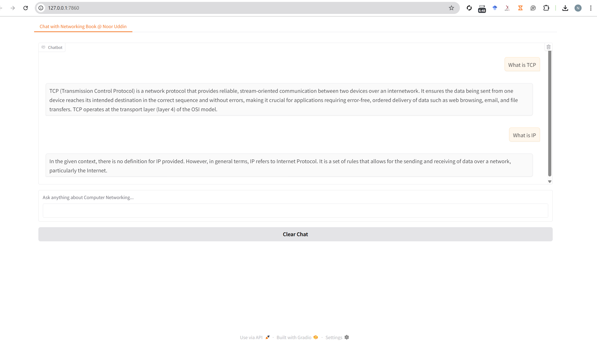

# Interactive Networking Tutor: A Book-Aware Local Chatbot Using RAG & Ollama

### Description:
This research prototype presents a multi-turn interactive chatbot designed by Noor Uddin. It enables question answering over the contents of the book *Computer Networking: A Top-Down Approach* using Retrieval-Augmented Generation (RAG), local LLMs with Ollama, and Chroma vector stores.

### Research Objective:
- Enable chapter-wise, interactive tutoring using full book PDFs.  
- Evaluate RAG with local LLMs for domain-specific learning.  
- Build a lightweight system that runs entirely offline using Ollama.

### Repository Contents:
- `app.py`: Gradio-based front-end for multi-turn chat  
- `rag_pipeline.py`: RAG logic to load PDF, embed, index, and answer  
- `data/`: Folder to place the Networking book in PDF format  
- `requirements.txt`: All dependencies including LangChain, Gradio, and Ollama

### How to Run:
1. Create conda env: `conda create -n networking-chatbot python=3.10` & activate  
2. Install dependencies: `pip install -r requirements.txt`  
3. Start Ollama: `ollama run mistral`  
4. Run chatbot: `python app.py`  
5. Open browser at `http://127.0.0.1:7860`

### README Snippet for GitHub:

**📘 Networking Book Chatbot with Local LLMs**  
An offline, multi-turn conversational AI designed to answer questions from *Computer Networking: A Top-Down Approach*. Powered by LangChain, Ollama, and Gradio.

### Features
- Uses Ollama for local model inference (Mistral)  
- Upload your PDF once and chat forever  
- Multi-turn Q&A with Gradio interface  
- Fully runs offline — no OpenAI or external APIs

### Example Questions & Answers

### 💬 Demo: Chatbot in Action

### Q: What is TCP?  
A: TCP (Transmission Control Protocol) is a network protocol that provides reliable, stream-oriented communication between two devices over an internetwork. It ensures the data being sent from one device reaches its intended destination in the correct sequence and without errors, making it crucial for applications requiring error-free, ordered delivery of data such as web browsing, email, and file transfers. TCP operates at the transport layer (layer 4) of the OSI model.

### Q: What is IP?  
A: In the given context, there is no definition for IP provided. However, in general terms, IP refers to Internet Protocol. It is a set of rules that allows for the sending and receiving of data over a network, particularly the Internet.

### Author
**Noor Uddin** — noor.cs2@yahoo.com
